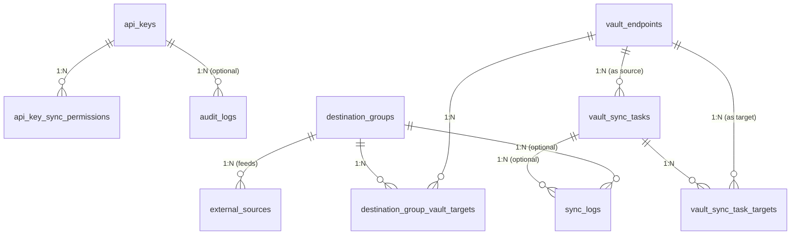

# Simply IP Sync - Database Schema & Entity Specifications

This document defines the complete database schema for `simply_ip_sync`. All entities are managed through **SeaORM** (2.0+) and must remain strictly **SQL-agnostic** (compatible with SQLite, PostgreSQL, and MySQL).

---

## 📊 Entity Relationship Diagram

### Mermaid Diagram


```mermaid
erDiagram
    api_keys ||--o{ api_key_sync_permissions : "1:N"
    api_keys ||--o{ audit_logs : "1:N (optional)"
    
    vault_endpoints ||--o{ destination_group_vault_targets : "1:N"
    destination_groups ||--o{ destination_group_vault_targets : "1:N"
    destination_groups ||--o{ external_sources : "1:N (feeds)"
    
    vault_endpoints ||--o{ vault_sync_tasks : "1:N (as source)"
    vault_endpoints ||--o{ vault_sync_task_targets : "1:N (as target)"
    vault_sync_tasks ||--o{ vault_sync_task_targets : "1:N"
    
    destination_groups ||--o{ sync_logs : "1:N (optional)"
    vault_sync_tasks ||--o{ sync_logs : "1:N (optional)"
```

### Compact ASCII Diagram

```
       [api_keys]
           │
           │ 1:N
           ▼
[api_key_sync_permissions]

[external_sources] ◄── (N:1) ── [destination_groups] ───► (1:N) ───► [destination_group_vault_targets] ◄─── (N:1) ─── [vault_endpoints]
     (feeds)                                                                                                                │
                                                                                                                              │ 1:N (Source)
                                                                                                                              ▼
                                          [vault_sync_tasks] ───► (1:N) ───► [vault_sync_task_targets] ◄──────── (N:1) ───────────┘
```

`destination_groups` is the scheduled, RBAC-managed parent (cron, target vaults, ingestion mode,
group-wide bogon-filtering policy); `external_sources` rows are its 1-to-N child feeds
(URL/parser/config only — no schedule, no targets, no RBAC of their own). A group's feeds are
fetched **concurrently** on every run and aggregated into one deduplicated set before push — see
`AGENT.MD` §3.A and `AGENT_NOTES.MD`'s corresponding session entry for the full rationale.

---

## 📁 Tables & Entities Specifications

### 1. `api_keys`
Stores authentication tokens, global access rights, and CIDR network binding rules for `simply_ip_sync` management.

| Field | Type | Attributes | Description |
| :--- | :--- | :--- | :--- |
| `id` | `UUID` | Primary Key, Auto-Gen | Unique identifier for the API key |
| `name` | `String` | Not Null | Human-readable key description |
| `key_hash` | `String` | Not Null, Unique | Argon2 / SHA-256 hash of the secret API key |
| `signing_secret` | `Text` | Nullable | Per-key HMAC-SHA256 secret (`X-Signature-256`). Encrypted with XChaCha20-Poly1305 when `SYNC_ENCRYPTION_KEY` is set (`v1.xchacha20poly1305.<nonce>.<ct>`); hex-encoded `v1.plain.<hex>` otherwise |
| `prefix` | `String` | Not Null, Indexed | First 8 characters of key for display and fast lookup |
| `is_master` | `Boolean` | Default: `false` | Bypasses all permission checks. Bootstrap-only |
| `master_marker` | `Integer` | **Generated**, Nullable, **Unique** | `GENERATED ALWAYS AS (CASE WHEN is_master THEN 1 ELSE NULL END)`. Enforces single master at database engine level |
| `can_manage_keys` | `Boolean` | Default: `false` | Global privilege to manage API keys (Master-only grant) |
| `can_manage_sources`| `Boolean` | Default: `false` | Global privilege to create external sources (Master-only grant) |
| `can_manage_vaults` | `Boolean` | Default: `false` | Global privilege to register vault endpoints (Master-only grant) |
| `parent_key_id` | `UUID` | Nullable, Indexed | Parent key creator ID (Lineage only, confers no authority) |
| `bound_ips` | `Text` | Nullable | Comma-separated CIDR ranges permitted to use this key |
| `created_at` | `DateTimeUtc` | Not Null | Creation timestamp |
| `updated_at` | `DateTimeUtc` | Not Null | Update timestamp |

---

### 2. `vault_endpoints`
Stores configuration and authentication credentials for target/source `simply_ip_vault` instances.

| Field | Type | Attributes | Description |
| :--- | :--- | :--- | :--- |
| `id` | `UUID` | Primary Key, Auto-Gen | Unique identifier for the vault endpoint |
| `name` | `String` | Not Null, Unique, Indexed | Human-readable endpoint name (e.g., `Vault-Paris-DMZ`) |
| `target_url` | `String` | Not Null | Base HTTP/HTTPS URL of the distant vault (e.g., `https://vault-paris.internal:3000`) |
| `api_key` | `Text` | Not Null | Plaintext `X-API-Key` sent to the remote Vault |
| `signing_secret` | `Text` | Not Null | HMAC signing secret used to compute `X-Signature-256` for remote Vault calls. Encrypted at rest via XChaCha20-Poly1305 (`v1.xchacha20poly1305...`) |
| `description` | `Text` | Nullable | Optional description |
| `owner_key_id` | `UUID` | Nullable, Indexed | Key holding lifecycle authority over this endpoint (§3) |
| `created_at` | `DateTimeUtc` | Not Null | Creation timestamp |
| `updated_at` | `DateTimeUtc` | Not Null | Update timestamp |

---

### 3. `destination_groups`
The scheduled, RBAC-managed parent resource for external-feed ingestion. Owns the cron schedule,
default target group name, ingestion mode, target vaults, and the group-wide bogon-filtering
policy; 1-to-N child feeds (`external_sources`) supply the actual URLs/parsers and are fetched
**concurrently**, aggregated, and pushed as one deduplicated batch per group execution.

| Field | Type | Attributes | Description |
| :--- | :--- | :--- | :--- |
| `id` | `UUID` | Primary Key, Auto-Gen | Unique identifier for the destination group |
| `name` | `String` | Not Null, Unique, Indexed | Human-readable name (e.g., `Public_Blocklists`) |
| `target_group_name` | `String` | Not Null | Default group name in target `ip_vault`s where the aggregated content lands |
| `cron_schedule` | `String` | Not Null | Cron expression for periodic execution of every child feed, concurrently, as one run |
| `mode` | `String` | Not Null, Default: `'upsert'` | Ingestion mode: `'upsert'` (never implicitly deletes) or `'full_replace'` (this run's aggregated content becomes the target group's full authoritative set). Applies to chunk 0 of each target's chunk sequence only — every later chunk of the same run downgrades to `'upsert'` automatically (see `AGENT.MD` §3.A) |
| `is_active` | `Boolean` | Default: `true` | Enable/disable automatic scheduling |
| `skip_bogon_filtering` | `Boolean` | Not Null, Default: `false` | When `false`, the aggregated feed set is sanitized (`bogon::sanitize` — loopback/private/link-local/other reserved ranges stripped) before push. `true` bypasses that stripping for a group deliberately ingesting internal/lab address space. A child feed may override this per-feed |
| `last_run_at` | `DateTimeUtc` | Nullable | Timestamp of last execution (across every child feed) |
| `owner_key_id` | `UUID` | Nullable, Indexed | Key holding lifecycle authority over this group. Also governs every child feed — feeds carry no independent RBAC of their own |
| `created_at` | `DateTimeUtc` | Not Null | Creation timestamp |
| `updated_at` | `DateTimeUtc` | Not Null | Update timestamp |

---

### 4. `external_sources` (feeds)
One feed ("child") belonging to a `destination_groups` ("parent") row. Carries only what's
specific to fetching and parsing *this* feed — the schedule, target vaults, ingestion mode, and
default group-wide bogon-filtering policy all live on the owning `destination_groups` row.

| Field | Type | Attributes | Description |
| :--- | :--- | :--- | :--- |
| `id` | `UUID` | Primary Key, Auto-Gen | Unique identifier for the feed |
| `destination_group_id` | `UUID` | Not Null, FK -> `destination_groups.id` (CASCADE) | Owning destination group |
| `name` | `String` | Not Null, Unique, Indexed | Human-readable name (e.g., `Spamhaus_DROP`), unique across all feeds regardless of group |
| `source_url` | `String` | Not Null | HTTP/HTTPS URL of the raw feed |
| `parser_type` | `String` | Not Null, Default: `'REGEX_LINE'` | Parser algorithm: `'REGEX_LINE'` or `'JSON_PATH'` |
| `parser_config_json`| `Text` | Nullable | JSON configuration for parser — field mapping (`JSON_PATH`'s `$.`-prefixed `target_address`/`last_seen_at` selectors, see `AGENT.MD` §2), custom headers, user agent |
| `max_age_days` | `Integer` | Nullable | Discards a record whose `last_seen_at` (per the `JSON_PATH` config's optional selector) is older than this many days. Ignored when no `last_seen_at` selector is configured |
| `skip_bogon_filtering` | `Boolean` | Nullable | Per-feed override of the owning group's `skip_bogon_filtering`. `NULL` inherits the group's own setting; a non-`NULL` value takes precedence for this feed's own contribution to the group's aggregated set |
| `created_at` | `DateTimeUtc` | Not Null | Creation timestamp |
| `updated_at` | `DateTimeUtc` | Not Null | Update timestamp |

---

### 5. `destination_group_vault_targets` (M:N Junction Table)
Maps a destination group to one or multiple target `vault_endpoints` with optional group override.
Replaces the pre-refactor `external_source_vault_targets` now that target vaults are configured
once per group rather than once per individual feed.

| Field | Type | Attributes | Description |
| :--- | :--- | :--- | :--- |
| `destination_group_id` | `UUID` | FK -> `destination_groups.id` (CASCADE) | Destination group ID |
| `vault_endpoint_id` | `UUID` | FK -> `vault_endpoints.id` (CASCADE) | Target Vault Endpoint ID |
| `target_group_name` | `Text` | Nullable | Specific target group name for this Vault endpoint (`NULL` falls back to `destination_groups.target_group_name`) |

*Constraints & Indexes:*
- Primary Key: Composite `(destination_group_id, vault_endpoint_id)`

---

### 6. `vault_sync_tasks`
Defines inter-vault delta replication tasks from a source Vault group to target Vaults.

| Field | Type | Attributes | Description |
| :--- | :--- | :--- | :--- |
| `id` | `UUID` | Primary Key, Auto-Gen | Unique sync task ID |
| `name` | `String` | Not Null, Unique, Indexed | Human-readable task name (e.g., `Sync_Paris_To_Lyon`) |
| `source_vault_id` | `UUID` | FK -> `vault_endpoints.id` (CASCADE) | Source Vault Endpoint ID |
| `source_group_name` | `String` | Not Null | Group name to query on source Vault |
| `target_group_name` | `String` | Not Null | Default target group name on receiving Vaults |
| `cron_schedule` | `String` | Not Null | Cron expression for periodic delta polling |
| `last_sync_at` | `DateTimeUtc` | Nullable | High-water mark timestamp used for `since=` delta queries |
| `mode` | `String` | Not Null, Default: `'upsert'` | Sync mode: strictly `'upsert'`. Deliberately **not** extended to `'full_replace'` the way `destination_groups.mode` was — a delta batch (`since=`-filtered) is an incremental slice of a group, not its full content, so `full_replace` here would read as "delete everything the current delta batch didn't happen to touch" on every run (see `AGENT.MD` §3.B) |
| `is_active` | `Boolean` | Default: `true` | Enable/disable task execution |
| `skip_bogon_filtering` | `Boolean` | Not Null, Default: `false` | When `false`, the delta fetched from the source vault is sanitized (loopback/private/link-local/other reserved ranges stripped) before push — a source vault's own group can accumulate one of these from a bad manual ban. `true` bypasses that stripping for a task deliberately replicating internal/lab address space between vaults |
| `owner_key_id` | `UUID` | Nullable, Indexed | Key holding lifecycle authority over this task |
| `created_at` | `DateTimeUtc` | Not Null | Creation timestamp |
| `updated_at` | `DateTimeUtc` | Not Null | Update timestamp |

---

### 7. `vault_sync_task_targets` (M:N Junction Table)
Maps an inter-vault sync task to one or multiple target `vault_endpoints` with optional group override.

| Field | Type | Attributes | Description |
| :--- | :--- | :--- | :--- |
| `vault_sync_task_id` | `UUID` | FK -> `vault_sync_tasks.id` (CASCADE) | Inter-vault sync task ID |
| `target_vault_id` | `UUID` | FK -> `vault_endpoints.id` (CASCADE) | Target receiving Vault Endpoint ID |
| `target_group_name` | `Text` | Nullable | Specific target group name on this receiving Vault (`NULL` falls back to `vault_sync_tasks.target_group_name`) |

*Constraints & Indexes:*
- Primary Key: Composite `(vault_sync_task_id, target_vault_id)`

---

### 8. `api_key_sync_permissions` (M:N Junction Table)
Maps granular permissions per API key for destination groups, sync tasks, or vault endpoints.

| Field | Type | Attributes | Description |
| :--- | :--- | :--- | :--- |
| `id` | `UUID` | Primary Key, Auto-Gen | Permission entry ID |
| `api_key_id` | `UUID` | FK -> `api_keys.id` (CASCADE) | Target API Key |
| `resource_type` | `String` | Not Null | Resource category: `'destination_group'`, `'sync_task'`, or `'vault_endpoint'`. Individual feeds (`external_sources`) carry no permission rows of their own — a feed's RBAC always resolves to its owning group |
| `resource_id` | `UUID` | Not Null | ID of the specific resource |
| `can_sync` | `Boolean` | Default: `false` | Permission to manually trigger `POST /api/.../trigger` |
| `can_manage` | `Boolean` | Default: `false` | Resource management half of R2 conjunction |
| `can_view_logs` | `Boolean` | Default: `true` | Permission to view execution logs for this task/group |
| `created_at` | `DateTimeUtc` | Not Null | Assignment timestamp |

*Constraints & Indexes:*
- Unique Index: `(api_key_id, resource_type, resource_id)`

---

### 9. `sync_logs`
Execution history for external ingestion and inter-vault sync tasks.

| Field | Type | Attributes | Description |
| :--- | :--- | :--- | :--- |
| `id` | `UUID` | Primary Key, Auto-Gen | Log entry ID |
| `job_type` | `String` | Not Null, Indexed | Task type: `'EXTERNAL_FEED'` or `'VAULT_SYNC'` |
| `job_id` | `UUID` | Not Null, Indexed | ID of `destination_groups` (one row per group execution, covering every child feed) or `vault_sync_tasks` |
| `job_name` | `String` | Not Null | Denormalized task name at execution time |
| `status` | `String` | Not Null, Indexed | Outcome: `'SUCCESS'`, `'FAILED'`, or `'PARTIAL'` |
| `items_processed` | `Integer` | Not Null, Default: 0 | Total IP/CIDRs parsed and sent, after temporal filtering and bogon sanitization |
| `chunks_sent` | `Integer` | Not Null, Default: 0 | Number of 5,000-record batch HTTP calls made |
| `duration_ms` | `Integer` | Not Null | Total processing time in milliseconds |
| `error_message` | `Text` | Nullable | Error details on failure, or feed-level errors / bogon-sanitization counts on an otherwise-successful run |
| `timestamp` | `DateTimeUtc` | Not Null, Indexed | Start timestamp of execution |

---

### 10. `audit_logs`
Security audit trail tracking mutating operations across `simply_ip_sync`.

| Field | Type | Attributes | Description |
| :--- | :--- | :--- | :--- |
| `id` | `UUID` | Primary Key, Auto-Gen | Unique audit log entry ID |
| `api_key_id` | `UUID` | Nullable, FK -> `api_keys.id` (SET NULL) | Performing API key ID |
| `api_key_name` | `String` | **Not Null** (since `m20260818_010217`) | Denormalized actor name — a point-in-time snapshot that survives the key's own deletion; `api_key_id` is nullable specifically so `api_key_name`/`api_key_prefix` remain the durable record |
| `api_key_prefix` | `String` | **Not Null** (since `m20260818_010217`) | Denormalized actor key prefix |
| `client_ip` | `String` | **Not Null** (since `m20260818_010217`) | Resolved client IP |
| `action` | `String` | Not Null, Indexed | Action name (e.g. `GROUP_CREATE`, `GROUP_TRIGGER`, `FEED_CREATE`, `TASK_UPDATE`, `KEY_ROTATE`) |
| `target_resource`| `String` | Nullable | Human-readable target name |
| `details` | `Text` | Nullable | Additional payload context |
| `timestamp` | `DateTimeUtc` | Not Null, Indexed | Event timestamp |

---

## ⚡ Mandatory Database Indexes

1. `api_keys.prefix`: Fast header matching.
2. `api_keys.key_hash`: Fast key lookup.
3. `destination_groups.name` & `external_sources.name` & `vault_sync_tasks.name`: Unique names.
4. `sync_logs (job_type, job_id)`: Quick task history filtering.
5. `sync_logs.timestamp`: Temporal log retention queries.
6. `audit_logs (action, timestamp)`: Audit trail queries.
7. `destination_groups.owner_key_id` & `vault_endpoints.owner_key_id` & `vault_sync_tasks.owner_key_id`: RBAC §6 pre-flight ownership inventory queries.